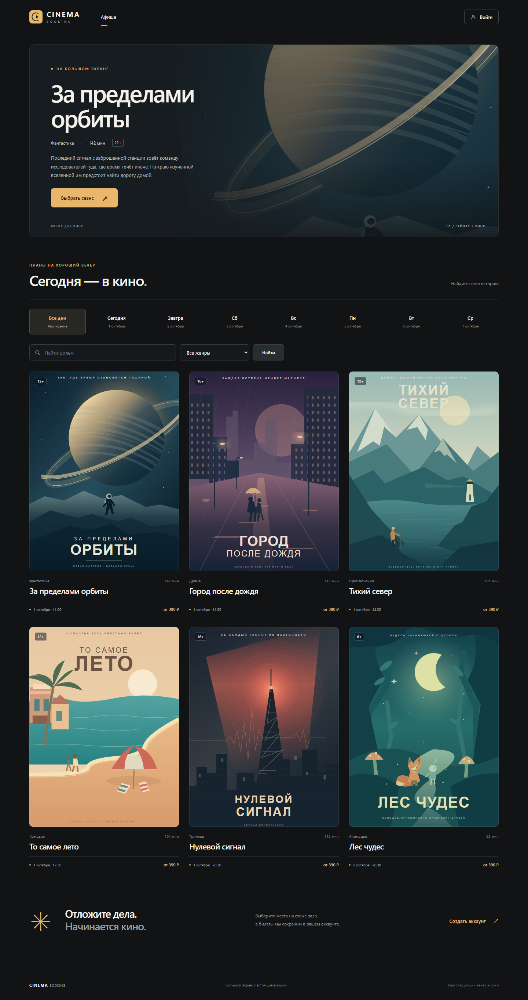
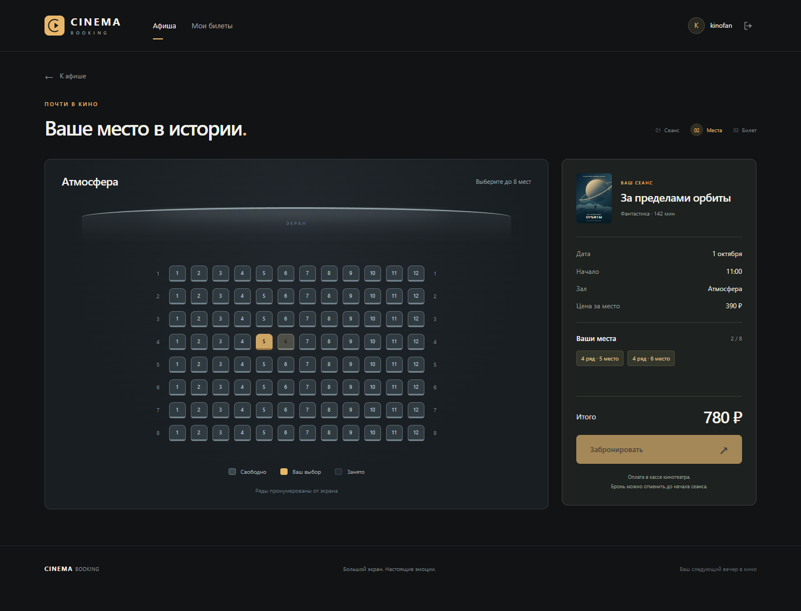
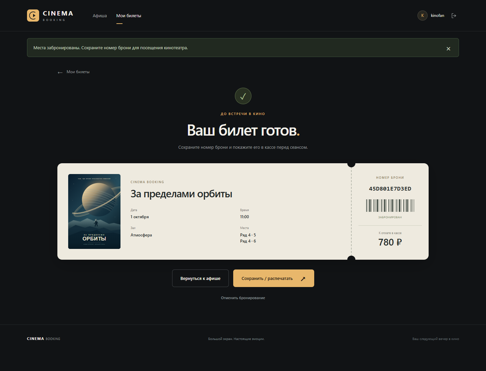
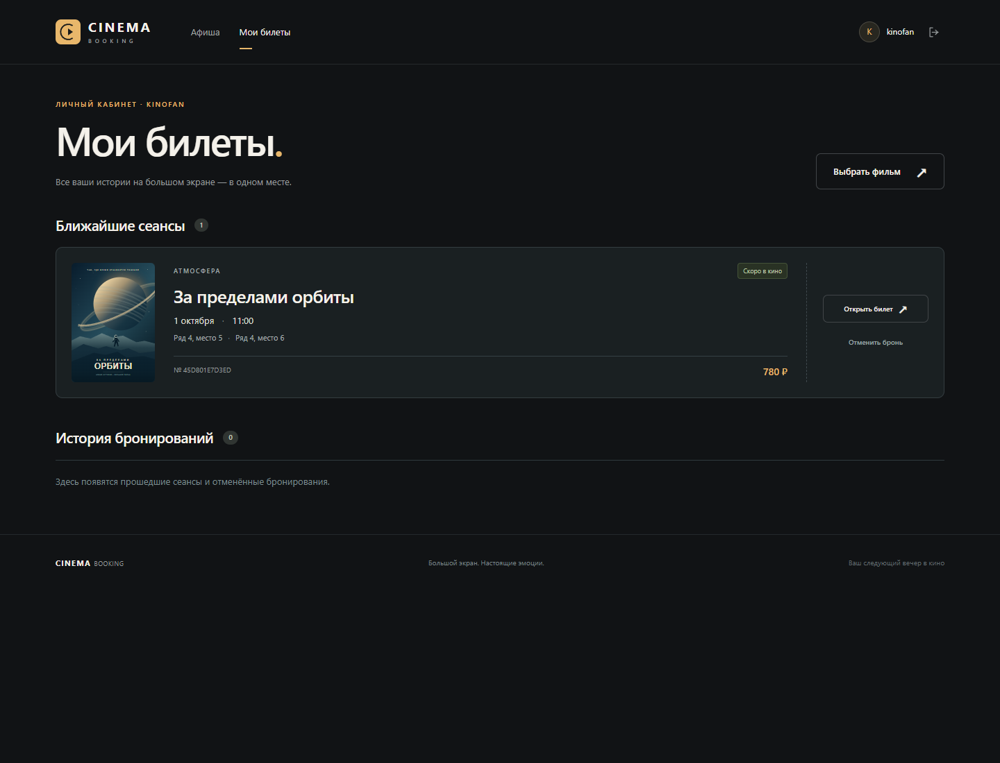
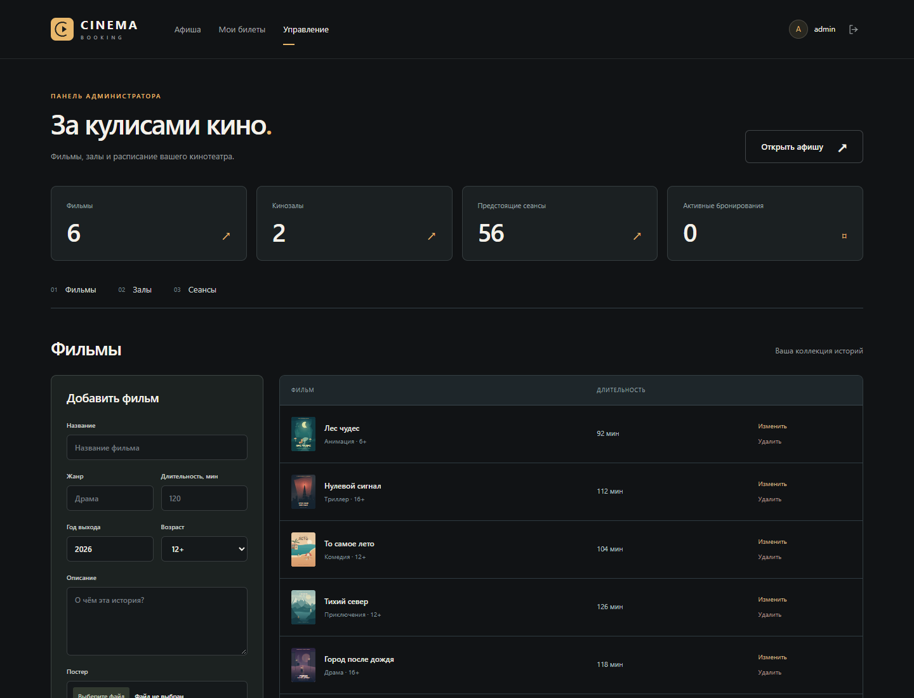
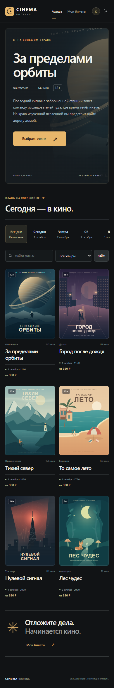

# Cinema Booking

Веб-приложение для бронирования мест в кинотеатре: от выбора фильма и сеанса до билета с номером брони. Внутри — интерактивная схема зала, личный кабинет и панель управления расписанием.

**Python 3.13 · Flask · PostgreSQL · Jinja2 · JavaScript**



## Возможности

**Для зрителя:** поиск по афише, фильтры по жанру и дате, расписание фильма, выбор до восьми мест за один раз, регистрация и вход. После бронирования доступен билет с местами и итоговой стоимостью; его можно распечатать. В личном кабинете хранятся предстоящие посещения и история, а бронь можно отменить до начала сеанса.

**Для администратора:** создание и редактирование фильмов, загрузка постеров, управление залами и расписанием. Приложение проверяет вместимость зала, цену и пересечения сеансов. Отмена сеанса отменяет связанные брони, сохраняя их в истории. Фильмы и залы, участвующие в расписании, защищены от удаления.

Интерфейс адаптирован для телефона и компьютера. Демоафиша состоит из шести вымышленных фильмов с локальными SVG-постерами, созданными для проекта; внешние сервисы изображений не требуются.

Это учебный проект с оплатой в кассе кинотеатра. Онлайн-оплата, рассылка писем и интеграция с кассовым оборудованием находятся вне текущего объёма приложения.

## Скриншоты

| Выбор мест | Билет |
| --- | --- |
|  |  |
| **Личный кабинет** | **Панель администратора** |
|  |  |

<details>
<summary>Мобильная версия</summary>



</details>

## Быстрый запуск на Windows

Понадобятся Git, Python 3.13 и установленный PostgreSQL 18. Команды ниже выполняются в PowerShell. Скрипт создаст для проекта отдельный кластер PostgreSQL на порту **5433**; существующая системная база ему не нужна.

```powershell
git clone https://github.com/daytimeserg0/cinema_booking.git
cd cinema_booking
py -3.13 -m venv .venv
.\.venv\Scripts\python.exe -m pip install -r requirements.txt
.\.venv\Scripts\python.exe local_database.py init
.\.venv\Scripts\python.exe seed_demo.py --refresh-schedule
.\.venv\Scripts\python.exe create_admin.py --username admin
.\.venv\Scripts\python.exe run_local.py
```

Откройте [http://127.0.0.1:5000](http://127.0.0.1:5000). Пароль администратора задаётся при выполнении `create_admin.py`, ввод в терминале скрыт. Общего пароля по умолчанию нет.

`local_database.py init` сам создаёт `.env` со случайными паролями и ключом приложения, базу `cinema_db` и её структуру. **Перед этим шагом копировать `.env.example` не нужно.** Уже существующие `.env`, данные и пароли скрипт не перезаписывает.

По умолчанию PostgreSQL ищется в `C:\Program Files\PostgreSQL\18\bin`. Если он установлен в другом месте, перед инициализацией укажите каталог:

```powershell
$env:POSTGRES_BIN = "D:\PostgreSQL\18\bin"
```

Для следующих запусков достаточно:

```powershell
.\.venv\Scripts\python.exe run_local.py
```

Скрипт запускает локальную базу при необходимости и применяет новые миграции. Приложение останавливается через `Ctrl+C`; PostgreSQL остаётся работать. Управление базой доступно командами `python local_database.py status`, `start` и `stop` из выбранного виртуального окружения. Если порт сайта занят, можно запустить `run_local.py --port 5001`.

### PyCharm

Откройте папку репозитория и выберите существующий интерпретатор `.venv\Scripts\python.exe`. Запускайте сохранённую конфигурацию **Cinema Booking** или файл `run_local.py`; рабочий каталог — корень проекта. Все библиотеки и настройки используются из того же окружения, что и при запуске из терминала.

### Демоафиша

`seed_demo.py` добавляет демофильмы. Флаг `--refresh-schedule` также создаёт два зала и заполняет свободные интервалы расписания на ближайшие семь дней. Когда афиша устареет, повторите:

```powershell
.\.venv\Scripts\python.exe seed_demo.py --refresh-schedule
```

Существующие сеансы и бронирования сохраняются. Повторный запуск пропускает уже занятые интервалы и сохраняет внесённые изменения в найденных демофильмах. Демоаккаунты скрипт не создаёт.

## Запуск через Docker

Альтернативный вариант — Docker с Compose. Установка Python и PostgreSQL на хосте для него не требуется. В свежем клоне создайте `.env`:

```powershell
Copy-Item .env.example .env
docker run --rm python:3.13-slim python -c "import secrets; print('DB_PASSWORD=' + secrets.token_urlsafe(32)); print('FLASK_SECRET_KEY=' + secrets.token_hex(32))"
```

В `.env` замените значения `DB_PASSWORD` и `FLASK_SECRET_KEY` сгенерированными строками. Если файл уже настроен, используйте существующий `.env`. Затем:

```powershell
docker compose up --build -d
docker compose exec web python seed_demo.py --refresh-schedule
docker compose exec web python create_admin.py --username admin
```

Сайт доступен по [http://127.0.0.1:5000](http://127.0.0.1:5000). Миграции выполняются перед запуском Gunicorn. Compose подключает приложение к контейнеру `db:5432`, переопределяя `DB_HOST` и `DB_PORT` из локальных настроек. Порт базы наружу не публикуется.

Данные PostgreSQL и загруженные постеры хранятся в отдельных именованных томах. `docker compose down` останавливает контейнеры с сохранением этих томов. Состояние можно посмотреть через `docker compose ps`, журнал приложения — через `docker compose logs web`.

## Подключение к существующему PostgreSQL

После создания виртуального окружения и установки зависимостей подготовьте отдельную базу с владельцем, под которым будет работать приложение. Например, в `psql`, подключённом от имени администратора PostgreSQL:

```sql
CREATE ROLE cinema_app LOGIN;
\password cinema_app
CREATE DATABASE cinema_db OWNER cinema_app;
```

Команда `\password` запросит пароль без сохранения его в тексте SQL. Для уже созданной роли используйте её текущие учётные данные.

Скопируйте `.env.example` в `.env`, заполните параметры `DB_*` и задайте случайный `FLASK_SECRET_KEY`. Порт должен соответствовать вашему серверу, обычно это `5432`. Далее:

```powershell
.\.venv\Scripts\python.exe migrate.py
.\.venv\Scripts\python.exe seed_demo.py --refresh-schedule
.\.venv\Scripts\python.exe create_admin.py --username admin
.\.venv\Scripts\python.exe run_local.py
```

Для новой установки импорт `backup.sql` не требуется. Структуру создаёт `schema.sql`, затем `migrate.py` применяет файлы из `migrations/`. Миграции выполняются в транзакции, учитываются в базе и сохраняют существующие данные. Если старые записи противоречат ограничениям, миграция завершается с ошибкой и откатывается, позволяя исправить причину.

## Настройки

Приложение читает `.env` из корня проекта. Переменные окружения имеют приоритет.

| Переменная | Назначение |
| --- | --- |
| `DB_HOST`, `DB_PORT` | Адрес и порт PostgreSQL; для приватной локальной базы — `127.0.0.1:5433` |
| `DB_NAME` | Имя базы, по умолчанию `cinema_db` |
| `DB_USER`, `DB_PASSWORD` | Учётные данные владельца базы приложения |
| `FLASK_SECRET_KEY` | Случайный секрет для сессий и подписанных условий бронирования |
| `CINEMA_TIMEZONE` | Часовой пояс кинотеатра, по умолчанию `Europe/Moscow` |
| `PORT` | Порт сайта, по умолчанию `5000` |
| `FLASK_DEBUG` | Режим отладки локального запуска, по умолчанию `false` |
| `SESSION_COOKIE_SECURE` | `false` для локального HTTP, `true` при работе через HTTPS |
| `POSTGRES_BIN` | Необязательный путь к утилитам PostgreSQL для Windows |

Время сеансов хранится и показывается как местное время кинотеатра. Часовой пояс следует выбрать до заполнения расписания.

Файлы `.env`, каталог `.local/` с локальной базой и служебными данными, виртуальное окружение и загруженные постеры исключены из Git. Пароли и рабочие данные в репозиторий не попадают.

## Логика бронирования

- Одна бронь объединяет от **1 до 8 мест** под общим номером. Запись всех мест выполняется одной транзакцией: сохраняются либо все выбранные места, либо ни одного.
- PostgreSQL запрещает две активные брони на одно место одного сеанса. Одновременные запросы не приводят к двойному бронированию.
- Условия на странице выбора мест подписаны и действуют **15 минут**. Если администратор изменил сеанс, зал или цену, страница потребует обновления. Этот срок не резервирует места: они закрепляются только после успешного бронирования.
- Стоимость каждого места сохраняется в брони на момент оформления. Итог билета рассчитывается по сохранённой цене.
- Зритель может отменить свою бронь до начала сеанса. Места освобождаются, запись остаётся в истории. Чужие билеты недоступны обычному пользователю.
- Между сеансами одного зала требуется **15 минут** перерыва. Изменение расписания проверяется с блокировкой зала; сеанс с историей бронирований можно отменить, но нельзя перенести или изменить.

Пароли хранятся в виде хешей. Формы защищены CSRF-токенами, права администратора проверяются на сервере. Загружаемые JPG, PNG и WebP проверяются и перекодируются перед сохранением.

## Тесты

Тесты используют настоящий PostgreSQL и отдельную базу, имя которой заканчивается на `_test`. Перед каждым тестом её таблицы очищаются. Основная база приложения при этом не используется.

Создайте тестовую базу с тем же владельцем, который указан в `DB_USER`. Пример для приватного локального кластера на Windows:

```powershell
& "C:\Program Files\PostgreSQL\18\bin\createdb.exe" -h 127.0.0.1 -p 5433 -U postgres -O cinema_app -W cinema_booking_test
```

Здесь нужен пароль администратора именно этого кластера. Для базы, созданной `local_database.py init`, он сохранён локально в `.local/postgres-admin.env`; для собственного сервера используйте его учётные данные. Приложение и тесты подключаются как `DB_USER`, с паролем из `.env`.

```powershell
.\.venv\Scripts\python.exe -m pip install -r requirements-dev.txt
$env:TEST_DB_NAME = "cinema_booking_test"
.\.venv\Scripts\python.exe -m pytest
```

Проверяются регистрация и доступ, CSRF, создание и отмена билетов, сохранение цен, ограничения базы, повторное применение миграций, загрузка постеров и конкурентные изменения бронирований и расписания. В `.github/workflows/tests.yml` настроен такой же запуск с PostgreSQL 18 для push и pull request.

## Структура проекта

```text
app.py                  маршруты и операции зрителя и администратора
services.py             валидация, подпись условий, работа с постерами
db.py                   подключение к PostgreSQL и транзакции
schema.sql              базовая структура новой базы
migrations/             изменения схемы
migrate.py              применение миграций
seed_demo.py            демофильмы и актуальное расписание
create_admin.py          создание администратора
local_database.py       управление приватным PostgreSQL на Windows
run_local.py            запуск базы, миграций и приложения
templates/              страницы Jinja2
static/                 стили, JavaScript и локальные постеры
tests/                  интеграционные тесты
docs/screenshots/        скриншоты интерфейса
Dockerfile              контейнер приложения с Gunicorn
compose.yaml            приложение, PostgreSQL и постоянные тома
```
